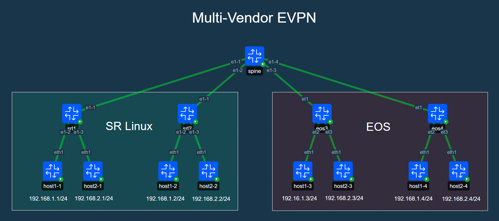
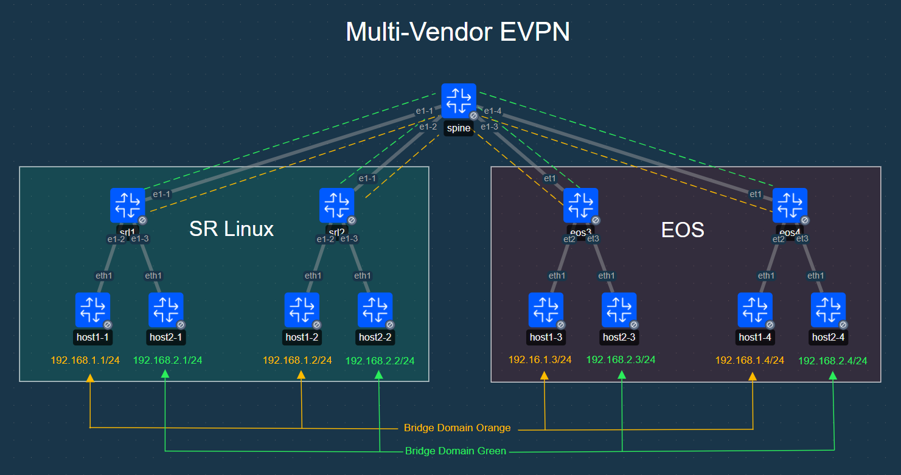

# Multi-Vendor EVPN Lab

## SR Linux and EOS EVPN Lab
This lab demonstrates interoperability of Nokia SR Linux and EOS devices. The lab contains two mac-vrfs within the same ip-vrf and demonstrates connectivity between the hosts.

> [!NOTE]
> This lab has been tested with SR Linux version 25.10.2 and EOS version 4.35.2F. Using other images may be possible with modifications to the topology file, but results are not guaranteed.
>
> SR Linux images will be downloaded automatically upon the first run of the lab. ***Due to licensing constraints EOS images must be obtained and imported into docker manually***. This process is [documented here](https://containerlab.dev/manual/kinds/ceos/#getting-arista-ceos-image).


## Lab Topology

### Diagram
#### Topology


#### Bridge Domains


### Deployment
```
╭─────────┬───────────────────────────────────────────┬─────────┬───────────────────╮
│   Name  │                 Kind/Image                │  State  │   IPv4/6 Address  │
├─────────┼───────────────────────────────────────────┼─────────┼───────────────────┤
│ eos3    │ arista_ceos                               │ running │ 172.20.20.14      │
│         │ ceos:4.35.2F                              │         │ 3fff:172:20:20::e │
├─────────┼───────────────────────────────────────────┼─────────┼───────────────────┤
│ eos4    │ arista_ceos                               │ running │ 172.20.20.13      │
│         │ ceos:4.35.2F                              │         │ 3fff:172:20:20::d │
├─────────┼───────────────────────────────────────────┼─────────┼───────────────────┤
│ host1-1 │ linux                                     │ running │ 172.20.20.10      │
│         │ ghcr.io/srl-labs/network-multitool:v0.5.0 │         │ 3fff:172:20:20::a │
├─────────┼───────────────────────────────────────────┼─────────┼───────────────────┤
│ host1-2 │ linux                                     │ running │ 172.20.20.5       │
│         │ ghcr.io/srl-labs/network-multitool:v0.5.0 │         │ 3fff:172:20:20::5 │
├─────────┼───────────────────────────────────────────┼─────────┼───────────────────┤
│ host1-3 │ linux                                     │ running │ 172.20.20.8       │
│         │ ghcr.io/srl-labs/network-multitool:v0.5.0 │         │ 3fff:172:20:20::8 │
├─────────┼───────────────────────────────────────────┼─────────┼───────────────────┤
│ host1-4 │ linux                                     │ running │ 172.20.20.9       │
│         │ ghcr.io/srl-labs/network-multitool:v0.5.0 │         │ 3fff:172:20:20::9 │
├─────────┼───────────────────────────────────────────┼─────────┼───────────────────┤
│ host2-1 │ linux                                     │ running │ 172.20.20.11      │
│         │ ghcr.io/srl-labs/network-multitool:v0.5.0 │         │ 3fff:172:20:20::b │
├─────────┼───────────────────────────────────────────┼─────────┼───────────────────┤
│ host2-2 │ linux                                     │ running │ 172.20.20.6       │
│         │ ghcr.io/srl-labs/network-multitool:v0.5.0 │         │ 3fff:172:20:20::6 │
├─────────┼───────────────────────────────────────────┼─────────┼───────────────────┤
│ host2-3 │ linux                                     │ running │ 172.20.20.4       │
│         │ ghcr.io/srl-labs/network-multitool:v0.5.0 │         │ 3fff:172:20:20::4 │
├─────────┼───────────────────────────────────────────┼─────────┼───────────────────┤
│ host2-4 │ linux                                     │ running │ 172.20.20.12      │
│         │ ghcr.io/srl-labs/network-multitool:v0.5.0 │         │ 3fff:172:20:20::c │
├─────────┼───────────────────────────────────────────┼─────────┼───────────────────┤
│ spine   │ nokia_srlinux                             │ running │ 172.20.20.7       │
│         │ ghcr.io/nokia/srlinux:25.10.2             │         │ 3fff:172:20:20::7 │
├─────────┼───────────────────────────────────────────┼─────────┼───────────────────┤
│ srl1    │ nokia_srlinux                             │ running │ 172.20.20.2       │
│         │ ghcr.io/nokia/srlinux:25.10.2             │         │ 3fff:172:20:20::2 │
├─────────┼───────────────────────────────────────────┼─────────┼───────────────────┤
│ srl2    │ nokia_srlinux                             │ running │ 172.20.20.3       │
│         │ ghcr.io/nokia/srlinux:25.10.2             │         │ 3fff:172:20:20::3 │
╰─────────┴───────────────────────────────────────────┴─────────┴───────────────────╯
```

## Hosts
The hosts in this lab follow a naming convention of `hostx-y` in which `x` indicates the subnet and `y` indicates the host number with the subnet (matching the switch it is connected to).

SR Linux Switch 1:
  - host1-1 (192.168.1.1/24)
  - host2-1 (192.168.2.1/24)

SR Linux Switch 2:
  - host1-2 (192.168.1.2/24)
  - host2-2 (192.168.2.2/24)

EOS Switch 3:
  - host1-3 (192.168.1.3/24)
  - host2-3 (192.168.2.3/24)

EOS Switch 4:
  - host1-4 (192.168.1.4/24)
  - host2-4 (192.168.2.4/24)


## Validation

### Hosts

#### Pinging Between Hosts
Each host has a script mounted called `ping_hosts` which, when executed, will ping all host IP addresses.

To log into one of the hosts use the `docker exec` command:
``` sh
docker exec -it host1-1 sh
```


One logged in you can run the `ping_hosts` command:
``` sh
ping_hosts
```

Example output:
```
/ # ping_hosts
PING 192.168.1.1 (192.168.1.1) 56(84) bytes of data.
64 bytes from 192.168.1.1: icmp_seq=1 ttl=64 time=0.071 ms
64 bytes from 192.168.1.1: icmp_seq=2 ttl=64 time=0.052 ms
64 bytes from 192.168.1.1: icmp_seq=3 ttl=64 time=0.040 ms

--- 192.168.1.1 ping statistics ---
3 packets transmitted, 3 received, 0% packet loss, time 409ms
rtt min/avg/max/mdev = 0.040/0.054/0.071/0.012 ms
PING 192.168.1.2 (192.168.1.2) 56(84) bytes of data.
64 bytes from 192.168.1.2: icmp_seq=1 ttl=64 time=5.19 ms
64 bytes from 192.168.1.2: icmp_seq=2 ttl=64 time=1.50 ms
64 bytes from 192.168.1.2: icmp_seq=3 ttl=64 time=1.19 ms

--- 192.168.1.2 ping statistics ---
3 packets transmitted, 3 received, 0% packet loss, time 401ms
rtt min/avg/max/mdev = 1.192/2.627/5.186/1.813 ms
PING 192.168.1.3 (192.168.1.3) 56(84) bytes of data.
64 bytes from 192.168.1.3: icmp_seq=1 ttl=64 time=5.15 ms
64 bytes from 192.168.1.3: icmp_seq=2 ttl=64 time=2.30 ms
64 bytes from 192.168.1.3: icmp_seq=3 ttl=64 time=2.96 ms

--- 192.168.1.3 ping statistics ---
3 packets transmitted, 3 received, 0% packet loss, time 401ms
rtt min/avg/max/mdev = 2.302/3.472/5.152/1.218 ms
PING 192.168.1.4 (192.168.1.4) 56(84) bytes of data.
64 bytes from 192.168.1.4: icmp_seq=1 ttl=64 time=5.28 ms
64 bytes from 192.168.1.4: icmp_seq=2 ttl=64 time=1.92 ms
64 bytes from 192.168.1.4: icmp_seq=3 ttl=64 time=2.41 ms

--- 192.168.1.4 ping statistics ---
3 packets transmitted, 3 received, 0% packet loss, time 401ms
rtt min/avg/max/mdev = 1.918/3.202/5.279/1.482 ms
PING 192.168.2.1 (192.168.2.1) 56(84) bytes of data.
64 bytes from 192.168.2.1: icmp_seq=1 ttl=63 time=24.6 ms
64 bytes from 192.168.2.1: icmp_seq=2 ttl=63 time=0.355 ms
64 bytes from 192.168.2.1: icmp_seq=3 ttl=63 time=0.427 ms

--- 192.168.2.1 ping statistics ---
3 packets transmitted, 3 received, 0% packet loss, time 409ms
rtt min/avg/max/mdev = 0.355/8.458/24.592/11.408 ms
PING 192.168.2.2 (192.168.2.2) 56(84) bytes of data.
64 bytes from 192.168.2.2: icmp_seq=1 ttl=253 time=20.3 ms
64 bytes from 192.168.2.2: icmp_seq=2 ttl=253 time=0.992 ms
64 bytes from 192.168.2.2: icmp_seq=3 ttl=253 time=1.28 ms

--- 192.168.2.2 ping statistics ---
3 packets transmitted, 3 received, 0% packet loss, time 401ms
rtt min/avg/max/mdev = 0.992/7.528/20.318/9.044 ms
PING 192.168.2.3 (192.168.2.3) 56(84) bytes of data.
64 bytes from 192.168.2.3: icmp_seq=1 ttl=62 time=48.7 ms
64 bytes from 192.168.2.3: icmp_seq=2 ttl=62 time=4.18 ms
64 bytes from 192.168.2.3: icmp_seq=3 ttl=62 time=4.01 ms

--- 192.168.2.3 ping statistics ---
3 packets transmitted, 3 received, 0% packet loss, time 402ms
rtt min/avg/max/mdev = 4.014/18.957/48.682/21.018 ms
PING 192.168.2.4 (192.168.2.4) 56(84) bytes of data.
64 bytes from 192.168.2.4: icmp_seq=1 ttl=62 time=44.7 ms
64 bytes from 192.168.2.4: icmp_seq=2 ttl=62 time=4.14 ms
64 bytes from 192.168.2.4: icmp_seq=3 ttl=62 time=2.40 ms

--- 192.168.2.4 ping statistics ---
3 packets transmitted, 3 received, 0% packet loss, time 401ms
rtt min/avg/max/mdev = 2.398/17.068/44.670/19.530 ms
```

#### ARP Table
To view the ARP table on the linux hosts use the following command:
```
ip neigh
```

Example output:
```
/ # ip neigh
192.168.1.254 dev eth1 lladdr aa:aa:aa:aa:aa:aa STALE
192.168.1.4 dev eth1 lladdr aa:c1:ab:98:41:28 DELAY
192.168.1.3 dev eth1 lladdr aa:c1:ab:dd:98:3b DELAY
192.168.1.2 dev eth1 lladdr aa:c1:ab:fc:7a:78 DELAY
```

### SRL Devices
#### ARP Table
To view the ARP table in SR Linux run the following command:
```
show arpnd arp-entries
```

Example output:
```
A:admin@srl1# show arpnd arp-entries
+-------------------+-------------------+-----------------+-------------------+------------------------------------+-----------------------------------------------------------------------+
|     Interface     |   Subinterface    |    Neighbor     |      Origin       |         Link layer address         |                                Expiry                                 |
+===================+===================+=================+===================+====================================+=======================================================================+
| ethernet-1/1      |                 0 |       10.1.10.0 |           dynamic | 1A:D4:0A:FF:00:01                  | 3 hours from now                                                      |
| irb0              |                 1 |     192.168.1.1 |           dynamic | AA:C1:AB:9C:3C:EB                  | 3 hours from now                                                      |
| irb0              |                 2 |     192.168.2.1 |           dynamic | AA:C1:AB:94:41:0C                  | 3 hours from now                                                      |
| irb0              |                 2 |     192.168.2.2 |              evpn | AA:C1:AB:C3:C0:B1                  |                                                                       |
| irb0              |                 2 |     192.168.2.3 |              evpn | AA:C1:AB:6D:92:BE                  |                                                                       |
| irb0              |                 2 |     192.168.2.4 |              evpn | AA:C1:AB:1F:95:35                  |                                                                       |
| mgmt0             |                 0 |     172.20.20.1 |           dynamic | 7A:03:0B:37:29:51                  | 3 hours from now                                                      |
+-------------------+-------------------+-----------------+-------------------+------------------------------------+-----------------------------------------------------------------------+
--------------------------------------------------------------------------------------------------------------------------------------------------------------------------------------------
  Total entries : 7 (0 static, 7 dynamic)
--------------------------------------------------------------------------------------------------------------------------------------------------------------------------------------------
```
#### MAC Table
To view the MAC Address table on SR Linux run the following command:
```
show network-instance bridge-table mac-table all
```

Example output:
```
A:admin@srl1# show network-instance bridge-table mac-table all
--------------------------------------------------------------------------------------------------------------------------------------------------------------------------------------------
Mac-table of network instance tenant1-bd1
--------------------------------------------------------------------------------------------------------------------------------------------------------------------------------------------
+--------------------+-----------------------------------------------------+------------+----------------+---------+--------+-----------------------------------------------------+
|      Address       |                     Destination                     | Dest Index |      Type      | Active  | Aging  |                     Last Update                     |
+====================+=====================================================+============+================+=========+========+=====================================================+
| 1A:B2:0B:FF:00:41  | irb-interface                                       | 0          | irb-interface  | true    | N/A    | 2026-03-13T22:44:18.000Z                            |
| 1A:FC:0C:FF:00:41  | vxlan-interface:vxlan0.10001 vtep:10.0.0.2          | 711579380  | evpn-static    | true    | N/A    | 2026-03-13T22:44:58.000Z                            |
|                    | vni:10001                                           |            |                |         |        |                                                     |
| AA:AA:AA:AA:AA:AA  | irb-interface                                       | 0          | irb-interface- | true    | N/A    | 2026-03-13T22:44:18.000Z                            |
|                    |                                                     |            | anycast        |         |        |                                                     |
| AA:C1:AB:98:41:28  | vxlan-interface:vxlan0.10001 vtep:10.0.0.4          | 711579377  | evpn           | true    | N/A    | 2026-03-13T22:46:00.000Z                            |
|                    | vni:10001                                           |            |                |         |        |                                                     |
| AA:C1:AB:9C:3C:EB  | ethernet-1/2.4097                                   | 6          | learnt         | true    | 280    | 2026-03-13T22:47:39.000Z                            |
| AA:C1:AB:DD:98:3B  | vxlan-interface:vxlan0.10001 vtep:10.0.0.3          | 711579373  | evpn           | true    | N/A    | 2026-03-13T22:45:35.000Z                            |
|                    | vni:10001                                           |            |                |         |        |                                                     |
| AA:C1:AB:FC:7A:78  | vxlan-interface:vxlan0.10001 vtep:10.0.0.2          | 711579380  | evpn           | true    | N/A    | 2026-03-13T22:47:39.000Z                            |
|                    | vni:10001                                           |            |                |         |        |                                                     |
+--------------------+-----------------------------------------------------+------------+----------------+---------+--------+-----------------------------------------------------+
--------------------------------------------------------------------------------------------------------------------------------------------------------------------------------------------
Mac-table of network instance tenant1-bd2
--------------------------------------------------------------------------------------------------------------------------------------------------------------------------------------------
+--------------------+-----------------------------------------------------+------------+----------------+---------+--------+-----------------------------------------------------+
|      Address       |                     Destination                     | Dest Index |      Type      | Active  | Aging  |                     Last Update                     |
+====================+=====================================================+============+================+=========+========+=====================================================+
| 1A:B2:0B:FF:00:41  | irb-interface                                       | 0          | irb-interface  | true    | N/A    | 2026-03-13T22:44:18.000Z                            |
| 1A:FC:0C:FF:00:41  | vxlan-interface:vxlan0.10002 vtep:10.0.0.2          | 711579381  | evpn-static    | true    | N/A    | 2026-03-13T22:44:58.000Z                            |
|                    | vni:10002                                           |            |                |         |        |                                                     |
| AA:AA:AA:AA:AA:AA  | irb-interface                                       | 0          | irb-interface- | true    | N/A    | 2026-03-13T22:44:18.000Z                            |
|                    |                                                     |            | anycast        |         |        |                                                     |
| AA:C1:AB:1F:95:35  | vxlan-interface:vxlan0.10002 vtep:10.0.0.4          | 711579376  | evpn           | true    | N/A    | 2026-03-13T22:49:37.000Z                            |
|                    | vni:10002                                           |            |                |         |        |                                                     |
| AA:C1:AB:6D:92:BE  | vxlan-interface:vxlan0.10002 vtep:10.0.0.3          | 711579374  | evpn           | true    | N/A    | 2026-03-13T22:49:37.000Z                            |
|                    | vni:10002                                           |            |                |         |        |                                                     |
| AA:C1:AB:94:41:0C  | ethernet-1/3.4097                                   | 7          | learnt         | true    | 279    | 2026-03-13T22:47:40.000Z                            |
| AA:C1:AB:C3:C0:B1  | vxlan-interface:vxlan0.10002 vtep:10.0.0.2          | 711579381  | evpn           | true    | N/A    | 2026-03-13T22:49:36.000Z                            |
|                    | vni:10002                                           |            |                |         |        |                                                     |
+--------------------+-----------------------------------------------------+------------+----------------+---------+--------+-----------------------------------------------------+
Total Irb Macs                 :    2 Total    2 Active
Total Static Macs              :    0 Total    0 Active
Total Duplicate Macs           :    0 Total    0 Active
Total Learnt Macs              :    2 Total    2 Active
Total Evpn Macs                :    6 Total    6 Active
Total Evpn static Macs         :    2 Total    2 Active
Total Irb anycast Macs         :    2 Total    2 Active
Total Proxy Antispoof Macs     :    0 Total    0 Active
Total Reserved Macs            :    0 Total    0 Active
Total Eth-cfm Macs             :    0 Total    0 Active
Total Irb Vrrps                :    0 Total    0 Active
```
#### BGP Neighbor
To validate the state of the BGP neighbors SR Linux devices use the following command:
```
show network-instance protocols bgp neighbor
```

Example output:
```
A:admin@srl1# show network-instance protocols bgp neighbor
--------------------------------------------------------------------------------------------------------------------------------------------------------------------------------------------
BGP neighbor summary for network-instance "default"
Flags: S static, D dynamic, L discovered by LLDP, B BFD enabled, - disabled, * slow
--------------------------------------------------------------------------------------------------------------------------------------------------------------------------------------------
--------------------------------------------------------------------------------------------------------------------------------------------------------------------------------------------
+--------------------+------------------------------+--------------------+-------+-----------+-----------------+-----------------+---------------+------------------------------+
|      Net-Inst      |             Peer             |       Group        | Flags |  Peer-AS  |      State      |     Uptime      |   AFI/SAFI    |        [Rx/Active/Tx]        |
+====================+==============================+====================+=======+===========+=================+=================+===============+==============================+
| default            | 10.1.10.0                    | bgpgroup-ebgp-     | S     | 10        | established     | 0d:0h:21m:58s   | evpn          | [22/21/13]                   |
|                    |                              | myfabric           |       |           |                 |                 | ipv4-unicast  | [4/4/1]                      |
+--------------------+------------------------------+--------------------+-------+-----------+-----------------+-----------------+---------------+------------------------------+
--------------------------------------------------------------------------------------------------------------------------------------------------------------------------------------------
Summary:
1 configured neighbors, 1 configured sessions are established, 0 disabled peers
0 dynamic peers
```

#### EVPN Routes
To view the EVPN routes on SR Linux run the following command:
```
show network-instance protocols bgp routes evpn route-type summary
```

Example output:
```
A:admin@srl1# show network-instance protocols bgp routes evpn route-type summary
--------------------------------------------------------------------------------------------------------------------------------------------------------------------------------------------
Show report for the BGP route table of network-instance "*"
--------------------------------------------------------------------------------------------------------------------------------------------------------------------------------------------
Status codes: u=used, *=valid, >=best, x=stale, b=backup, w=unused-weight-only
Origin codes: i=IGP, e=EGP, ?=incomplete
--------------------------------------------------------------------------------------------------------------------------------------------------------------------------------------------
BGP Router ID: 10.0.0.1      AS: 1      Local AS: 1
--------------------------------------------------------------------------------------------------------------------------------------------------------------------------------------------
Type 2 MAC-IP Advertisement Routes
+-------+-----------------+-----------+-----------------+-----------------+-----------------+-------+-----------------+-----------------+------------------------------+-----------------+
| Statu |     Route-      |  Tag-ID   |   MAC-address   |   IP-address    |    neighbor     | Path- |    Next-Hop     |      Label      |             ESI              |  MAC Mobility   |
|   s   |  distinguisher  |           |                 |                 |                 |  id   |                 |                 |                              |                 |
+=======+=================+===========+=================+=================+=================+=======+=================+=================+==============================+=================+
| *>    | 10.0.0.2:10000  | 0         | 1A:FC:0C:FF:00: | 0.0.0.0         | 10.1.10.0       | 0     | 10.0.0.2        | 10000           | 00:00:00:00:00:00:00:00:00:0 | -               |
|       |                 |           | 00              |                 |                 |       |                 |                 | 0                            |                 |
| u*>   | 10.0.0.2:10001  | 0         | 1A:FC:0C:FF:00: | 0.0.0.0         | 10.1.10.0       | 0     | 10.0.0.2        | 10001           | 00:00:00:00:00:00:00:00:00:0 | Seq:0/Static    |
|       |                 |           | 41              |                 |                 |       |                 |                 | 0                            |                 |
| u*>   | 10.0.0.2:10001  | 0         | AA:AA:AA:AA:AA: | 192.168.1.254   | 10.1.10.0       | 0     | 10.0.0.2        | 10001           | 00:00:00:00:00:00:00:00:00:0 | Seq:0/Static    |
|       |                 |           | AA              |                 |                 |       |                 |                 | 0                            |                 |
| u*>   | 10.0.0.2:10001  | 0         | AA:C1:AB:FC:7A: | 0.0.0.0         | 10.1.10.0       | 0     | 10.0.0.2        | 10001           | 00:00:00:00:00:00:00:00:00:0 | -               |
|       |                 |           | 78              |                 |                 |       |                 |                 | 0                            |                 |
| u*>   | 10.0.0.2:10002  | 0         | 1A:FC:0C:FF:00: | 0.0.0.0         | 10.1.10.0       | 0     | 10.0.0.2        | 10002           | 00:00:00:00:00:00:00:00:00:0 | Seq:0/Static    |
|       |                 |           | 41              |                 |                 |       |                 |                 | 0                            |                 |
| u*>   | 10.0.0.2:10002  | 0         | AA:AA:AA:AA:AA: | 192.168.2.254   | 10.1.10.0       | 0     | 10.0.0.2        | 10002           | 00:00:00:00:00:00:00:00:00:0 | Seq:0/Static    |
|       |                 |           | AA              |                 |                 |       |                 |                 | 0                            |                 |
| u*>   | 10.0.0.2:10002  | 0         | AA:C1:AB:C3:C0: | 0.0.0.0         | 10.1.10.0       | 0     | 10.0.0.2        | 10002           | 00:00:00:00:00:00:00:00:00:0 | -               |
|       |                 |           | B1              |                 |                 |       |                 |                 | 0                            |                 |
| u*>   | 10.0.0.2:10002  | 0         | AA:C1:AB:C3:C0: | 192.168.2.2     | 10.1.10.0       | 0     | 10.0.0.2        | 10002 + 10000   | 00:00:00:00:00:00:00:00:00:0 | -               |
|       |                 |           | B1              |                 |                 |       |                 |                 | 0                            |                 |
| u*>   | 10.0.0.3:10001  | 0         | AA:C1:AB:DD:98: | 0.0.0.0         | 10.1.10.0       | 0     | 10.0.0.3        | 10001           | 00:00:00:00:00:00:00:00:00:0 | -               |
|       |                 |           | 3B              |                 |                 |       |                 |                 | 0                            |                 |
| u*>   | 10.0.0.3:10002  | 0         | AA:C1:AB:6D:92: | 0.0.0.0         | 10.1.10.0       | 0     | 10.0.0.3        | 10002           | 00:00:00:00:00:00:00:00:00:0 | -               |
|       |                 |           | BE              |                 |                 |       |                 |                 | 0                            |                 |
| u*>   | 10.0.0.3:10002  | 0         | AA:C1:AB:6D:92: | 192.168.2.3     | 10.1.10.0       | 0     | 10.0.0.3        | 10002 + 10000   | 00:00:00:00:00:00:00:00:00:0 | -               |
|       |                 |           | BE              |                 |                 |       |                 |                 | 0                            |                 |
| u*>   | 10.0.0.4:10001  | 0         | AA:C1:AB:98:41: | 0.0.0.0         | 10.1.10.0       | 0     | 10.0.0.4        | 10001           | 00:00:00:00:00:00:00:00:00:0 | -               |
|       |                 |           | 28              |                 |                 |       |                 |                 | 0                            |                 |
| u*>   | 10.0.0.4:10002  | 0         | AA:C1:AB:1F:95: | 0.0.0.0         | 10.1.10.0       | 0     | 10.0.0.4        | 10002           | 00:00:00:00:00:00:00:00:00:0 | -               |
|       |                 |           | 35              |                 |                 |       |                 |                 | 0                            |                 |
| u*>   | 10.0.0.4:10002  | 0         | AA:C1:AB:1F:95: | 192.168.2.4     | 10.1.10.0       | 0     | 10.0.0.4        | 10002 + 10000   | 00:00:00:00:00:00:00:00:00:0 | -               |
|       |                 |           | 35              |                 |                 |       |                 |                 | 0                            |                 |
+-------+-----------------+-----------+-----------------+-----------------+-----------------+-------+-----------------+-----------------+------------------------------+-----------------+
--------------------------------------------------------------------------------------------------------------------------------------------------------------------------------------------
Type 3 Inclusive Multicast Ethernet Tag Routes
+--------+-------------------------------------------+------------+---------------------+-------------------------------------------+--------+-------------------------------------------+
| Status |            Route-distinguisher            |   Tag-ID   |    Originator-IP    |                 neighbor                  | Path-  |                 Next-Hop                  |
|        |                                           |            |                     |                                           |   id   |                                           |
+========+===========================================+============+=====================+===========================================+========+===========================================+
| u*>    | 10.0.0.2:10001                            | 0          | 10.0.0.2            | 10.1.10.0                                 | 0      | 10.0.0.2                                  |
| u*>    | 10.0.0.2:10002                            | 0          | 10.0.0.2            | 10.1.10.0                                 | 0      | 10.0.0.2                                  |
| u*>    | 10.0.0.3:10001                            | 0          | 10.0.0.3            | 10.1.10.0                                 | 0      | 10.0.0.3                                  |
| u*>    | 10.0.0.3:10002                            | 0          | 10.0.0.3            | 10.1.10.0                                 | 0      | 10.0.0.3                                  |
| u*>    | 10.0.0.4:10001                            | 0          | 10.0.0.4            | 10.1.10.0                                 | 0      | 10.0.0.4                                  |
| u*>    | 10.0.0.4:10002                            | 0          | 10.0.0.4            | 10.1.10.0                                 | 0      | 10.0.0.4                                  |
+--------+-------------------------------------------+------------+---------------------+-------------------------------------------+--------+-------------------------------------------+
--------------------------------------------------------------------------------------------------------------------------------------------------------------------------------------------
Type 5 IP Prefix Routes
+--------+-------------------------+------------+---------------------+-------------------------+--------+-------------------------+-------------------------+-------------------------+
| Status |   Route-distinguisher   |   Tag-ID   |     IP-address      |        neighbor         | Path-  |        Next-Hop         |          Label          |         Gateway         |
|        |                         |            |                     |                         |   id   |                         |                         |                         |
+========+=========================+============+=====================+=========================+========+=========================+=========================+=========================+
| u*>    | 10.0.0.2:10000          | 0          | 192.168.1.0/24      | 10.1.10.0               | 0      | 10.0.0.2                | 10000                   | 0.0.0.0                 |
| u*>    | 10.0.0.2:10000          | 0          | 192.168.2.0/24      | 10.1.10.0               | 0      | 10.0.0.2                | 10000                   | 0.0.0.0                 |
| u*>    | 10.0.0.3:10000          | 0          | 192.168.1.0/24      | 10.1.10.0               | 0      | 10.0.0.3                | 10000                   | 0.0.0.0                 |
| u*>    | 10.0.0.3:10000          | 0          | 192.168.2.0/24      | 10.1.10.0               | 0      | 10.0.0.3                | 10000                   | 0.0.0.0                 |
| u*>    | 10.0.0.4:10000          | 0          | 192.168.1.0/24      | 10.1.10.0               | 0      | 10.0.0.4                | 10000                   | 0.0.0.0                 |
| u*>    | 10.0.0.4:10000          | 0          | 192.168.2.0/24      | 10.1.10.0               | 0      | 10.0.0.4                | 10000                   | 0.0.0.0                 |
+--------+-------------------------+------------+---------------------+-------------------------+--------+-------------------------+-------------------------+-------------------------+
--------------------------------------------------------------------------------------------------------------------------------------------------------------------------------------------
0 Ethernet Auto-Discovery routes 0 used, 0 valid, 0 stale
14 MAC-IP Advertisement routes 13 used, 14 valid, 0 stale
6 Inclusive Multicast Ethernet Tag routes 6 used, 6 valid, 0 stale
0 Ethernet Segment routes 0 used, 0 valid, 0 stale
6 IP Prefix routes 6 used, 6 valid, 0 stale
0 Selective Multicast Ethernet Tag routes 0 used, 0 valid, 0 stale
0 Selective Multicast Membership Report Sync routes 0 used, 0 valid, 0 stale
0 Selective Multicast Leave Sync routes 0 used, 0 valid, 0 stale
--------------------------------------------------------------------------------------------------------------------------------------------------------------------------------------------
```

### EOS Devices


#### ARP Table
To view the ARP table on EOS devices use the following command:
```
show arp tenant1
```

Example output:
```
eos3#show arp vrf tenant1
Legend:
 not learned: Associated MAC address is not present in the MAC address table
 -: Static (configuration or programmed by feature)
Address         Age (sec)  Hardware Addr   Interface
192.168.1.1             -  aac1.ab9c.3ceb  Vlan1, Vxlan1
192.168.2.1             -  aac1.ab94.410c  Vlan2, Vxlan1
192.168.2.2             -  aac1.abc3.c0b1  Vlan2, Vxlan1
192.168.2.3       0:08:39  aac1.ab6d.92be  Vlan2, Ethernet3
192.168.2.4             -  aac1.ab1f.9535  Vlan2, Vxlan1
```

#### MAC Table
To view the MAC Address table on EOS devices use the following command:
```
show mac address-table
```

Example output:
```
eos3#show mac address-table
          Mac Address Table
------------------------------------------------------------------

Vlan    Mac Address       Type        Ports      Moves   Last Move
----    -----------       ----        -----      -----   ---------
   1    1ab2.0bff.0041    STATIC      Vx1
   1    1afc.0cff.0041    STATIC      Vx1
   1    aaaa.aaaa.aaaa    STATIC      Cpu
   1    aac1.ab98.4128    DYNAMIC     Vx1        1       0:12:37 ago
   1    aac1.ab9c.3ceb    DYNAMIC     Vx1        1       0:10:58 ago
   1    aac1.abdd.983b    DYNAMIC     Et2        1       0:00:26 ago
   1    aac1.abfc.7a78    DYNAMIC     Vx1        1       0:00:26 ago
   2    1ab2.0bff.0041    STATIC      Vx1
   2    1afc.0cff.0041    STATIC      Vx1
   2    aaaa.aaaa.aaaa    STATIC      Cpu
   2    aac1.ab1f.9535    DYNAMIC     Vx1        1       0:00:24 ago
   2    aac1.ab6d.92be    DYNAMIC     Et3        1       0:12:29 ago
   2    aac1.ab94.410c    DYNAMIC     Vx1        1       0:10:57 ago
   2    aac1.abc3.c0b1    DYNAMIC     Vx1        1       0:09:01 ago
Total Mac Addresses for this criterion: 14

          Multicast Mac Address Table
------------------------------------------------------------------

Vlan    Mac Address       Type        Ports
----    -----------       ----        -----
Total Mac Addresses for this criterion: 0
```

#### BGP Neighbors
To view the status of the BGP neighbors on EOS devices use the following command:
```
show bgp summary
```

Example output:
```
eos3#show bgp summary
BGP summary information for VRF default
Router identifier 10.0.0.3, local AS number 3
Neighbor           AS Session State AFI/SAFI                AFI/SAFI State   NLRI Rcd   NLRI Acc   NLRI Adv
--------- ----------- ------------- ----------------------- -------------- ---------- ---------- ----------
10.3.10.0          10 Established   IPv4 Unicast            Negotiated              4          4          1
10.3.10.0          10 Established   L2VPN EVPN              Negotiated             29         29          6
```

#### EVPN Routes
To view the EVPN routes on EOS use the following command:

```
show bgp evpn
```

Example output:
```
eos3# show bgp evpn
BGP routing table information for VRF default
Router identifier 10.0.0.3, local AS number 3
Route status codes: * - valid, > - active, S - Stale, E - ECMP head, e - ECMP
                    c - Contributing to ECMP, % - Pending best path selection
Origin codes: i - IGP, e - EGP, ? - incomplete
AS Path Attributes: Or-ID - Originator ID, C-LST - Cluster List, LL Nexthop - Link Local Nexthop

          Network                Next Hop              Metric  LocPref Weight  Path
 * >      RD: 10.0.0.1:10000 mac-ip 1ab2.0bff.0000
                                 10.0.0.1              -       100     0       10 1 i
 * >      RD: 10.0.0.1:10001 mac-ip 1ab2.0bff.0041
                                 10.0.0.1              -       100     0       10 1 i
 * >      RD: 10.0.0.1:10002 mac-ip 1ab2.0bff.0041
                                 10.0.0.1              -       100     0       10 1 i
 * >      RD: 10.0.0.2:10000 mac-ip 1afc.0cff.0000
                                 10.0.0.2              -       100     0       10 2 i
 * >      RD: 10.0.0.2:10001 mac-ip 1afc.0cff.0041
                                 10.0.0.2              -       100     0       10 2 i
 * >      RD: 10.0.0.2:10002 mac-ip 1afc.0cff.0041
                                 10.0.0.2              -       100     0       10 2 i
 * >      RD: 10.0.0.1:10001 mac-ip aaaa.aaaa.aaaa 192.168.1.254
                                 10.0.0.1              -       100     0       10 1 i
 * >      RD: 10.0.0.2:10001 mac-ip aaaa.aaaa.aaaa 192.168.1.254
                                 10.0.0.2              -       100     0       10 2 i
 * >      RD: 10.0.0.1:10002 mac-ip aaaa.aaaa.aaaa 192.168.2.254
                                 10.0.0.1              -       100     0       10 1 i
 * >      RD: 10.0.0.2:10002 mac-ip aaaa.aaaa.aaaa 192.168.2.254
                                 10.0.0.2              -       100     0       10 2 i
 * >      RD: 10.0.0.4:10002 mac-ip aac1.ab1f.9535
                                 10.0.0.4              -       100     0       10 4 i
 * >      RD: 10.0.0.4:10002 mac-ip aac1.ab1f.9535 192.168.2.4
                                 10.0.0.4              -       100     0       10 4 i
 * >      RD: 10.0.0.3:10002 mac-ip aac1.ab6d.92be
                                 -                     -       -       0       i
 * >      RD: 10.0.0.3:10002 mac-ip aac1.ab6d.92be 192.168.2.3
                                 -                     -       -       0       i
 * >      RD: 10.0.0.1:10002 mac-ip aac1.ab94.410c
                                 10.0.0.1              -       100     0       10 1 i
 * >      RD: 10.0.0.1:10002 mac-ip aac1.ab94.410c 192.168.2.1
                                 10.0.0.1              -       100     0       10 1 i
 * >      RD: 10.0.0.4:10001 mac-ip aac1.ab98.4128
                                 10.0.0.4              -       100     0       10 4 i
 * >      RD: 10.0.0.1:10001 mac-ip aac1.ab9c.3ceb
                                 10.0.0.1              -       100     0       10 1 i
 * >      RD: 10.0.0.1:10001 mac-ip aac1.ab9c.3ceb 192.168.1.1
                                 10.0.0.1              -       100     0       10 1 i
 * >      RD: 10.0.0.2:10002 mac-ip aac1.abc3.c0b1
                                 10.0.0.2              -       100     0       10 2 i
 * >      RD: 10.0.0.2:10002 mac-ip aac1.abc3.c0b1 192.168.2.2
                                 10.0.0.2              -       100     0       10 2 i
 * >      RD: 10.0.0.3:10001 mac-ip aac1.abdd.983b
                                 -                     -       -       0       i
 * >      RD: 10.0.0.2:10001 mac-ip aac1.abfc.7a78
                                 10.0.0.2              -       100     0       10 2 i
 * >      RD: 10.0.0.1:10001 imet 10.0.0.1
                                 10.0.0.1              -       100     0       10 1 i
 * >      RD: 10.0.0.1:10002 imet 10.0.0.1
                                 10.0.0.1              -       100     0       10 1 i
 * >      RD: 10.0.0.2:10001 imet 10.0.0.2
                                 10.0.0.2              -       100     0       10 2 i
 * >      RD: 10.0.0.2:10002 imet 10.0.0.2
                                 10.0.0.2              -       100     0       10 2 i
 * >      RD: 10.0.0.3:10001 imet 10.0.0.3
                                 -                     -       -       0       i
 * >      RD: 10.0.0.3:10002 imet 10.0.0.3
                                 -                     -       -       0       i
 * >      RD: 10.0.0.4:10001 imet 10.0.0.4
                                 10.0.0.4              -       100     0       10 4 i
 * >      RD: 10.0.0.4:10002 imet 10.0.0.4
                                 10.0.0.4              -       100     0       10 4 i
 * >      RD: 10.0.0.1:10000 ip-prefix 192.168.1.0/24
                                 10.0.0.1              -       100     0       10 1 i
 * >      RD: 10.0.0.2:10000 ip-prefix 192.168.1.0/24
                                 10.0.0.2              -       100     0       10 2 i
 * >      RD: 10.0.0.3:10000 ip-prefix 192.168.1.0/24
                                 -                     -       -       0       i
 * >      RD: 10.0.0.4:10000 ip-prefix 192.168.1.0/24
                                 10.0.0.4              -       100     0       10 4 i
 * >      RD: 10.0.0.1:10000 ip-prefix 192.168.2.0/24
                                 10.0.0.1              -       100     0       10 1 i
 * >      RD: 10.0.0.2:10000 ip-prefix 192.168.2.0/24
                                 10.0.0.2              -       100     0       10 2 i
 * >      RD: 10.0.0.3:10000 ip-prefix 192.168.2.0/24
                                 -                     -       -       0       i
 * >      RD: 10.0.0.4:10000 ip-prefix 192.168.2.0/24
                                 10.0.0.4              -       100     0       10 4 i
```